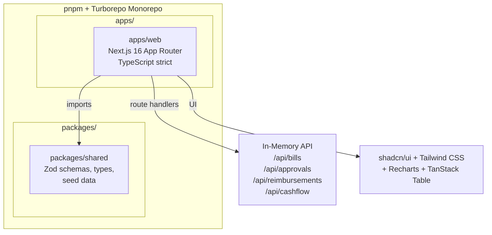

# SpendFlow — AI-Powered Spend Management

SpendFlow is a modern, pixel-perfect spend-management dashboard for finance teams built with Next.js 16 (App Router), Tailwind CSS v4, and shadcn/ui.

## Features
- **Dashboard**: KPI cards, 30-day cashflow area chart, spend by category donut chart.
- **Bills**: Search, filter, sort, paginate, and bulk approve bills in a data table with CSV export.
- **Approvals**: Dedicated queue for managers to approve or reject bills (with required reasons).
- **Reimbursements**: Form validation via React Hook Form and Zod.
- **Responsive**: Complete desktop and mobile support, including a bottom tab bar on mobile.
- **Dark Mode**: Flawless light and dark mode switching via `next-themes`.

## Architecture

## Setup & Running
1. Clone the repository
2. Install dependencies: `pnpm install`
3. Run the development server: `pnpm dev`
4. Open `http://localhost:3000`

## Design Decisions
- **Monorepo**: Turborepo + pnpm workspaces allows sharing types, Zod schemas, and mock data between frontend apps.
- **Component System**: shadcn/ui ensures accessible, robust components without being tied to a heavy NPM package.
- **Theme/Tokens**: Tailwind v4 with an inline `@theme` in `globals.css` using an 8-pt scale and strict OKLCH palettes for a premium feel.
- **State/API**: Next.js Route Handlers coupled with an in-memory Singleton store simulate realistic API behaviors (latency, errors) before a real backend is implemented.
