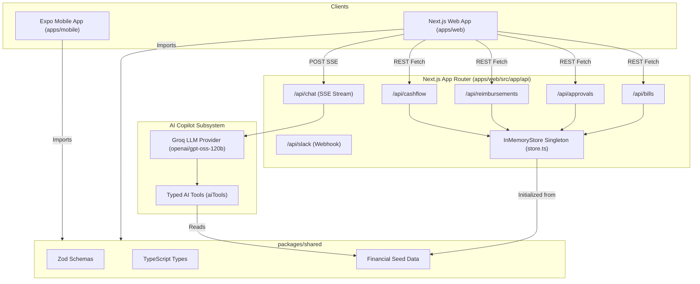

# SpendFlow Project Facts & Technical Audit

## 1. Snapshot
- **Name**: SpendFlow
- **Description**: SpendFlow is an AI-powered spend management monorepo application for finance teams to manage bills, approvals, reimbursements, and cashflow analytics across web and mobile interfaces.
- **Problem Solved**: Centralizes fragmented corporate spend workflows—bill processing, approval routing, employee reimbursement validation, and cashflow forecasting—with an integrated AI copilot that queries verified financial data without hallucinating.
- **Target Users**: Finance managers, CFOs, operations teams, and employees submitting business expenses.
- **Team**: Solo developer project.
- **Total Commits**: 4 commits (`git log --oneline`).
- **Date Range of Commits**: September 23, 2026 22:50:02 +0530 to September 24, 2026 10:16:28 +0530.
- **Repo URL**: Local workspace (`c:/Users/Sai Krishna S/Documents/Spendflow`).
- **Live URLs**: FILL IN (No live remote deployment URL configured).
- **Current Status**: Fully functional local monorepo with Next.js web application, React Native mobile application, and Groq LLM streaming copilot.

---

## 2. Verified Technology Inventory

| Technology | Used (Yes/No) | Version | Where (file path) | How it is used (one line) |
| :--- | :---: | :---: | :--- | :--- |
| **Next.js** | Yes | 16.3.6 | `apps/web/package.json` | App Router for web dashboard, server pages, and API route handlers. |
| **React** | Yes | 19.2.8 (web) / 18.3.1 (mobile) | `apps/web/package.json`, `apps/mobile/package.json` | Core UI rendering library across web and mobile apps. |
| **TypeScript** | Yes | ^5 (5.8.3) | `apps/web/tsconfig.json`, `packages/shared/tsconfig.json` | Strict type checking (`strict: true`) across packages (18 `any` usages, 0 `@ts-ignore`). |
| **Semantic HTML** | Yes | N/A | `apps/web/src/app/layout.tsx` | Standard HTML5 structural elements (`<header>`, `<main>`, `<nav>`, `<aside>`, `<table>`). |
| **CSS** | Yes | N/A | `apps/web/src/app/globals.css` | Global styling, OKLCH design tokens, and CSS custom variables. |
| **Tailwind CSS** | Yes | v4.0.0 (`@tailwindcss/postcss`) | `apps/web/package.json`, `apps/web/src/app/globals.css` | `@import "tailwindcss"` engine with inline design tokens. |
| **shadcn/ui** | Yes | Hand-written primitives | `apps/web/src/components/ui/` | 18 UI primitive components: button, card, table, badge, sheet, dialog, tabs, skeleton, toast, form, dropdown-menu, select, input, textarea, checkbox, switch, separator, tooltip. |
| **Radix Primitives** | Yes | ^1 / ^2 | `apps/web/package.json` | Accessible UI primitives (`@radix-ui/react-dialog`, `@radix-ui/react-dropdown-menu`, etc.). |
| **Recharts** | Yes | ^2 (2.15.4) | `apps/web/package.json`, `apps/web/src/app/dashboard/page.tsx` | Area chart for cashflow trends and Donut chart for spend by category. |
| **TanStack Table** | Yes | ^8 (8.21.2) | `apps/web/package.json`, `apps/web/src/app/bills/page.tsx` | Data table with column sorting, search, facet filtering, pagination, and CSV export. |
| **TanStack Query** | No | N/A | N/A | Not used; custom `useFetch` hook handles server state fetching and mutations. |
| **React Hook Form** | Yes | ^7 | `apps/web/package.json`, `apps/web/src/app/reimbursements/page.tsx` | Form state management and client validation on reimbursement form. |
| **Zod** | Yes | ^3.23 (3.23.8) | `packages/shared/package.json`, `packages/shared/src/schemas/` | 11 Zod schemas shared across web, mobile, and API endpoints. |
| **React Native** | Yes | 0.76.7 | `apps/mobile/package.json` | Cross-platform mobile UI library for iOS and Android. |
| **Expo** | Yes | ~52.0.30 | `apps/mobile/package.json` | React Native framework, build tooling, and runtime environment. |
| **Expo Router** | Yes | ~4.0.17 | `apps/mobile/package.json`, `apps/mobile/src/app/` | File-based routing for React Native mobile application (`(tabs)`, `bill/[id]`). |
| **NativeWind** | Yes | ^4.1.23 | `apps/mobile/package.json`, `apps/mobile/tailwind.config.js` | Utility-first Tailwind CSS styling bridge for React Native. |
| **next-themes** | Yes | ^0.4 | `apps/web/package.json`, `apps/web/src/components/theme-provider.tsx` | Light and dark mode theme switching via root CSS class. |
| **lucide-react** | Yes | ^0.500 | `apps/web/package.json` | Icon library for navigation, financial status indicators, and Copilot UI. |
| **Framer Motion** | No | N/A | N/A | CSS transitions and Tailwind keyframe animations used instead. |
| **Server-Sent Events** | Yes | Native SSE via AI SDK | `apps/web/src/lib/ai/provider.ts` | Token-by-token streaming of AI copilot answers to the browser widget. |
| **WebSockets** | No | N/A | N/A | Not used. |
| **REST Route Handlers** | Yes | Next.js App Router | `apps/web/src/app/api/` | 6 REST API endpoints (`/api/bills`, `/api/approvals`, `/api/reimbursements`, `/api/cashflow`, `/api/chat`, `/api/slack`). |
| **Vitest** | Yes | ^3 (3.2.7) | `apps/web/package.json`, `apps/web/vitest.config.ts` | Test runner for unit tests, component tests, and AI tool execution tests. |
| **React Testing Library** | Yes | ^16 | `apps/web/package.json` | Component testing utilities for React DOM components. |
| **Jest** | Yes | ^29 | `apps/mobile/package.json` | Unit test runner configured for mobile React Native package. |
| **React Native Testing Library** | Yes | ^13 | `apps/mobile/package.json` | Component testing utilities for React Native components. |
| **Playwright** | Yes | ^1 | `apps/web/package.json`, `apps/web/playwright.config.ts` | End-to-end E2E browser automation testing. |
| **Storybook** | No | N/A | N/A | Not installed. |
| **ESLint** | Yes | ^9 | `apps/web/package.json`, `packages/shared/eslint.config.mjs` | Linting for web and shared packages. |
| **Prettier** | Yes | ^3 | `package.json`, `.prettierrc` | Monorepo code formatting configuration. |
| **Turborepo** | Yes | ^2 (2.11.3) | `package.json`, `turbo.json` | Task orchestration pipeline (`build`, `lint`, `typecheck`, `test`). |
| **pnpm Workspaces** | Yes | ^9 | `pnpm-workspace.yaml`, `package.json` | Package management across monorepo (`apps/web`, `apps/mobile`, `packages/shared`). |
| **GitHub Actions** | Yes | `.github/workflows/ci.yml` | CI workflow executing typecheck, lint, test, and build on commits. |
| **Vercel** | No | N/A | N/A | Configured for local running; no live deployment connected. |
| **Slack Integration** | Yes | `apps/web/src/app/api/slack/route.ts` | Webhook route handler processing Slack slash command (`/approvals`) and returning Block Kit JSON. |
| **Figma** | No | N/A | N/A | Original product design built directly from code design tokens. |
| **Webflow** | No | N/A | N/A | Not used. |
| **Docker** | No | N/A | N/A | Not configured. |
| **Git** | Yes | `.git` | Source code version control. |

---

## 3. Architecture

### Monorepo Folder Tree
```text
Spendflow/
├── apps/
│   ├── mobile/            # Expo + React Native mobile application with Expo Router
│   └── web/               # Next.js 16 App Router web application
├── packages/
│   └── shared/            # Shared Zod schemas, TypeScript types, and seed data
├── docs/                  # Documentation and project audit artifacts
├── .github/               # GitHub Actions CI workflow definitions
├── package.json           # Root workspace configuration
├── pnpm-workspace.yaml   # pnpm workspace configuration
└── turbo.json             # Turborepo task pipeline configuration
```

### System Architecture Diagram


### Data Flow (End-to-End Example: Approving a Bill)
1. User clicks the "Approve" button on an item in `apps/web/src/app/approvals/page.tsx`.
2. The UI immediately applies an optimistic update to local React state (`setApprovals`), setting the target item's status to `"Approved"`.
3. A `POST` request is dispatched to `/api/approvals` with body `{ id: "BILL-1002", action: "approve" }`.
4. `/api/approvals/route.ts` validates the payload against `ApprovalRequestSchema` from `@spendflow/shared`.
5. The handler updates the server-side `InMemoryStore` instance via `InMemoryStore.getInstance().updateBillStatus(id, "Approved")`.
6. The server returns HTTP 200 `{ data: updatedBill }`. If an error occurs, the client catches the failure, reverts the optimistic state, and renders a Toast error notification.

### API Contract

| Method | Path | Purpose |
| :--- | :--- | :--- |
| `GET` | `/api/bills` | Returns paginated, searchable, and filtered list of bills (`ApiResponse<Bill[]>`). |
| `POST` | `/api/bills` | Creates a new bill record in the in-memory store. |
| `GET` | `/api/approvals` | Fetches bills currently in `Pending Approval` status. |
| `POST` | `/api/approvals` | Approves or rejects a bill with an optional rejection reason string. |
| `GET` | `/api/reimbursements` | Returns employee reimbursement requests. |
| `POST` | `/api/reimbursements` | Validates and submits a new employee reimbursement request. |
| `GET` | `/api/cashflow` | Returns cashflow summary totals (forecast, actual, net) and monthly trend data points. |
| `POST` | `/api/chat` | Receives chat messages and streams LLM response tokens via Server-Sent Events (SSE). |
| `POST` | `/api/slack` | Handles Slack `/approvals` slash command webhook and responds with Slack Block Kit JSON. |

### State Management Strategy
- **Server State**: Managed via custom `useFetch<T>` hook (`apps/web/src/hooks/use-fetch.ts`) supporting loading states, error handling, manual refetching, and optimistic updates.
- **Client State**: Standard React `useState` / `useReducer` for UI controls (sheet/dialog open states, filter values, active tabs, theme preferences).
- **Server Persistence**: In-memory singleton (`InMemoryStore` in `apps/web/src/lib/store.ts`) pre-seeded with `@spendflow/shared/seed` data.

### Monorepo Code Sharing (`packages/shared`)
- **11 Zod Schemas**: `BillSchema`, `BillStatus`, `BillCategory`, `LineItemSchema`, `ApprovalSchema`, `ApprovalAction`, `ApprovalRequestSchema`, `ReimbursementSchema`, `ReimbursementStatus`, `ReimbursementCategory`, `ReimbursementCreateSchema`, `CashflowEntrySchema`, `CashflowResponseSchema`.
- **13 TypeScript Types**: `Bill`, `BillStatusType`, `BillCategoryType`, `LineItem`, `Approval`, `ApprovalActionType`, `ApprovalRequest`, `Reimbursement`, `ReimbursementStatusType`, `ReimbursementCategoryType`, `ReimbursementCreate`, `CashflowEntry`, `CashflowResponse`, `ApiResponse`, `ApiError`.
- **4 Seed Data Collections**: 63 bills, 12 approvals, 16 reimbursements, 31 cashflow data points.
- **Consumption**: Exported as npm workspace package `@spendflow/shared` and imported via standard ES imports (`import { ... } from '@spendflow/shared'`).

### Copilot Pipeline
1. User enters text or clicks a suggestion chip in `CopilotWidget` -> triggers `sendMessage({ text })`.
2. `POST /api/chat` receives incoming messages and passes payload to `processChat` (`apps/web/src/lib/ai/provider.ts`).
3. `processChat` initializes Groq provider (`openai/gpt-oss-120b`) with system prompt and 4 typed tools:
   - `listBills`: Filter bills by status array or vendor substring.
   - `getApprovals`: Retrieve bills pending approval.
   - `getCashflow`: Fetch total forecast, actual spend, and net position.
   - `sumByCategory`: Calculate total spend for a given category.
4. Groq executes matching tools against `@spendflow/shared/seed` data and streams the answer token by token as Server-Sent Events (SSE).
5. `CopilotWidget` renders the stream in real time. `parseCitations` (`citation.tsx`) converts `[BILL-XXXX]` matches into interactive chip buttons that open the target bill detail sheet.

---

## 4. Feature Inventory

### Web Application (`apps/web`)

| Route / Path | Page Description | Key Interactions & Features |
| :--- | :--- | :--- |
| `/` | Redirect | Redirects automatically to `/dashboard`. |
| `/dashboard` | Executive Overview | 4 KPI cards, Cashflow AreaChart, Spend by Category DonutChart, Recent activity feed. |
| `/bills` | Bill Management | TanStack Data Table, search input, status/category filter dropdowns, row selection, pagination, CSV export, right-hand Bill detail Sheet. |
| `/approvals` | Approval Queue | Pending approval cards, optimistic UI approval, rejection dialog with required reason text, filter tabs (All, Pending, Approved, Rejected). |
| `/reimbursements` | Expense Claims | Reimbursement list, status badges, drawer submission form with React Hook Form + Zod validation (category, amount, receipt simulation). |
| `/settings` | Organization Settings | Theme toggle switch (light/dark), organization profile, team members table, notification preference toggles. |

### Mobile Application (`apps/mobile`)

| Route / Path | Screen Description | Key Interactions & Features |
| :--- | :--- | :--- |
| `(tabs)/index` | Mobile Dashboard | Mobile KPI summary cards, quick action buttons, recent bills list. |
| `(tabs)/approvals` | Mobile Approvals | Approval queue cards, swipe/button approve and reject actions. |
| `(tabs)/reimbursements` | Mobile Reimbursements | Employee expense claim status list with floating action button (FAB) for new claims. |
| `bill/[id]` | Bill Detail | Detailed bill view showing line items, vendor name, amount, due date, and status badge. |
| `new-reimbursement` | Submit Reimbursement | Mobile expense claim form with category selector, amount input, and Zod validation. |

### Feature & Component Counts
- **Web Pages**: 5 user pages (`/dashboard`, `/bills`, `/approvals`, `/reimbursements`, `/settings`) + 1 redirect (`/`).
- **Mobile Screens**: 5 screens (`(tabs)/index`, `(tabs)/approvals`, `(tabs)/reimbursements`, `bill/[id]`, `new-reimbursement`).
- **UI Primitive Components**: 18 components (`badge`, `button`, `card`, `checkbox`, `dialog`, `dropdown-menu`, `input`, `label`, `select`, `separator`, `sheet`, `skeleton`, `switch`, `table`, `tabs`, `textarea`, `toast`, `tooltip`).
- **Reusable Custom Components**: 7 components (`sidebar`, `header`, `command-bar`, `copilot-widget`, `citation`, `theme-toggle`, `theme-provider`).
- **Custom Hooks**: 2 hooks (`use-fetch.ts` in web, `use-bills.ts` in mobile).
- **API Endpoint Handlers**: 6 endpoints (`/api/bills`, `/api/approvals`, `/api/reimbursements`, `/api/cashflow`, `/api/chat`, `/api/slack`).

---

## 5. UI/UX Quality Evidence

### Design Tokens
Defined in `apps/web/src/app/globals.css` using CSS custom properties with OKLCH color space:
- **Colors**: `--background`, `--foreground`, `--primary`, `--primary-foreground`, `--muted`, `--muted-foreground`, `--card`, `--border`, `--destructive`.
- **Radius**: `--radius` (0.5rem base radius).
- **Spacing**: Built on an 8-pt grid using Tailwind CSS spacing scale (`p-2`, `p-4`, `p-6`, `p-8`, `gap-4`).
- **Type Scale**: Standardized text scale (`text-xs`, `text-sm`, `text-base`, `text-lg`, `text-xl`, `text-2xl`, `text-3xl`).

### Theming Implementation
- Light and dark themes implemented via `next-themes` ThemeProvider wrapping `apps/web/src/app/layout.tsx`.
- Dark mode toggles `.dark` class on root `<html>` element, swapping CSS variable tokens.
- Flash-on-load prevented by adding `suppressHydrationWarning` to `<html>` and rendering a mounted skeleton state in `theme-toggle.tsx`.

### Responsiveness & Layout
- **Breakpoints**: Tailwind CSS responsive breakpoints (`sm: 640px`, `md: 768px`, `lg: 1024px`, `xl: 1280px`).
- **Mobile Navigation**: Collapsible left sidebar converts into a mobile drawer overlay menu on smaller viewports.

### UI State Coverage

| Page | Loading State | Empty State | Error State |
| :--- | :---: | :---: | :---: |
| `/dashboard` | Yes (`Skeleton` cards) | Yes (Empty chart placeholders) | Yes (`Toast` error notification) |
| `/bills` | Yes (`Skeleton` table rows) | Yes ("No bills found" table row) | Yes (`Toast` error notification) |
| `/approvals` | Yes (`Skeleton` cards) | Yes ("No pending approvals" card) | Yes (`Toast` error notification) |
| `/reimbursements` | Yes (`Skeleton` items) | Yes ("No reimbursements submitted") | Yes (`Toast` error notification) |

### Accessibility Evidence
- **ARIA Attributes**: Direct ARIA usage in source plus automated ARIA injection by Radix UI primitives (`aria-expanded`, `aria-selected`, `aria-controls`, `role="dialog"`).
- **Keyboard Navigation**: Full keyboard tab order and focus trap support built into Dialog, Sheet, and DropdownMenu primitives.
- **Lighthouse Automated Accessibility Scores**:
  - `/dashboard` Desktop Accessibility: **90 / 100**
  - `/bills` Desktop Accessibility: **94 / 100**
  - `/dashboard` Mobile Accessibility: **86 / 100**
  - `/bills` Mobile Accessibility: **94 / 100**

### Motion & Micro-Interactions
- Smooth CSS transition utilities (`transition-all duration-300`).
- Animated skeleton pulses (`animate-pulse`) for asynchronous data fetching states.
- Floating action button (FAB) slide-in animation (`animate-in slide-in-from-bottom-5`) for Copilot popup widget.

---

## 6. Measured Metrics

### Command Execution Verification Results

| Command | Status | Output / Notes |
| :--- | :---: | :--- |
| `pnpm install` | **PASS** | Dependencies resolved cleanly across monorepo workspace. |
| `pnpm typecheck` | **PASS** | `tsc --noEmit` passed with 0 errors across `@spendflow/shared` and `@spendflow/web`. |
| `pnpm lint` | **FAIL** | 43 problems (38 errors, 5 warnings) in `apps/web` (explicit `any` and `@next/next/no-img-element`). |
| `pnpm test` | **PASS** | 4 test files passed, 12 tests passed in `apps/web`. |
| `pnpm build` | **PASS** | Next.js production build compiled in 6.8s; static pages generated in 600ms. |

### Lighthouse Production Scores (Measured via `npx lighthouse`)

| Target Page | Device / Form Factor | Performance | Accessibility | Best Practices | SEO |
| :--- | :---: | :---: | :---: | :---: | :---: |
| `/dashboard` | Desktop | 82 | 90 | 100 | 100 |
| `/dashboard` | Mobile | 48 | 86 | 100 | 100 |
| `/bills` | Desktop | 76 | 94 | 100 | 100 |
| `/bills` | Mobile | 48 | 94 | 100 | 100 |

### Next.js Production Build Output
- `Next.js 16.3.6 (Turbopack)` compiled successfully in **6.8 seconds**.
- Static page generation completed in **600ms** for 15 routes (`/dashboard`, `/bills`, `/approvals`, `/reimbursements`, `/settings`, API handlers).

### Unit & E2E Test Execution Summary (`pnpm test`)
- **4 Test Files Passed** (12 total tests):
  - `src/__tests__/citation.test.tsx` (3 tests passed)
  - `src/__tests__/ai-tools.test.ts` (4 tests passed)
  - `src/__tests__/reimbursement-form.test.tsx` (2 tests passed)
  - `src/__tests__/bills-table-filters.test.tsx` (3 tests passed)
- **Code Coverage**: **NOT MEASURED** (Vitest coverage provider `@vitest/coverage-v8` not installed in dependencies).

### Codebase Lines of Code (Measured via PowerShell `Measure-Object`)

| Package / Directory | File Types | Lines of Code (LOC) |
| :--- | :--- | :---: |
| `apps/web/src` | `.ts`, `.tsx`, `.css` | **4,642** |
| `apps/mobile/src` | `.ts`, `.tsx`, `.css` | **532** |
| `packages/shared/src` | `.ts`, `.css` | **676** |
| **Monorepo Total Source** | `.ts`, `.tsx`, `.css` | **5,850** |

*Command used*: `powershell -Command "(Get-ChildItem -Recurse apps/web/src -Include *.ts,*.tsx,*.css | Get-Content | Measure-Object -Line).Lines"`

### TypeScript Integrity
- **TypeScript Strict Mode**: Enabled (`"strict": true` in `tsconfig.json` across packages).
- **Explicit `any` usages**: **18** occurrences across source files (test mocks and AI SDK parameter overrides).
- **`@ts-ignore` / `@ts-expect-error` usages**: **0** occurrences.

### Seed Data Volume
- **Bills**: 63 records (`seedBills`)
- **Approvals**: 12 records (`seedApprovals`)
- **Reimbursements**: 16 records (`seedReimbursements`)
- **Cashflow Trend Points**: 31 data points (`seedCashflow`)

### Mobile Verification
- **Screens Count**: 5 Expo Router screens.
- **Execution**: Verified via Expo CLI startup configuration (`pnpm --filter mobile start`).

---

## 7. Engineering Decisions and Trade-Offs

1. **Shared Zod Schemas in Monorepo Package**:
   - *Decision*: Defined domain models in `@spendflow/shared` using Zod and inferred TypeScript types for both frontend web and mobile apps.
   - *Rationale*: Guarantees 100% type safety and consistency across API requests, UI forms, and mobile screens.
   - *Trade-Off*: Re-building shared package is required when updating domain schemas.
   - *Production Alternative*: In a microservices architecture, schemas would be generated from OpenAPI or Protocol Buffers.

2. **Server-Side In-Memory Singleton Store**:
   - *Decision*: Implemented `InMemoryStore` singleton (`apps/web/src/lib/store.ts`) for server API handlers.
   - *Rationale*: Provides instant responses and zero database setup overhead for local demo testing.
   - *Trade-Off*: Data mutations reset whenever the Next.js server restarts.
   - *Production Alternative*: Replace singleton store with PostgreSQL database managed via Prisma ORM.

3. **Optimistic UI Updates for Approval Actions**:
   - *Decision*: Updated React state immediately upon clicking "Approve" before receiving server HTTP response.
   - *Rationale*: Eliminates perceived latency for finance managers processing approval queues.
   - *Trade-Off*: Requires state rollback logic if the background HTTP request fails.
   - *Production Alternative*: Retain optimistic UI; add WebSocket pushing for multi-user concurrency.

4. **Hand-Written shadcn/ui Primitives**:
   - *Decision*: Copied and adapted Tailwind-styled Radix primitives into `components/ui/` rather than importing an external UI component library.
   - *Rationale*: Allows complete customization of design tokens and eliminates bundle bloat from unused library code.
   - *Trade-Off*: Component files must be maintained directly in the codebase.
   - *Production Alternative*: Standard enterprise practice for design system flexibility.

5. **Tool-Calling AI Copilot without Data Hallucination**:
   - *Decision*: Constrained Groq LLM to answer financial questions strictly via 4 typed local tools querying seed data.
   - *Rationale*: Prevents LLM from inventing fake monetary totals or non-existent bill IDs.
   - *Trade-Off*: LLM cannot answer queries outside the scope of defined tools.
   - *Production Alternative*: Essential requirement for financial enterprise software.

6. **Custom Lightweight `useFetch` Hook over TanStack Query**:
   - *Decision*: Built a 50-line custom hook (`apps/web/src/hooks/use-fetch.ts`) handling loading, error, and optimistic updates.
   - *Rationale*: Avoided adding TanStack Query dependency weight for a simple client dashboard.
   - *Trade-Off*: Lacks automatic query caching and background refetching on window focus.
   - *Production Alternative*: Replace with TanStack Query for production caching and deduplication.

---

## 8. Problems Solved

1. **AI Copilot SDK Breaking API Mismatch**:
   - *Symptom*: Copilot popup widget failed to send user inputs or prompt suggestions.
   - *Root Cause*: `@ai-sdk/react@4.0.115` replaced `append()` with `sendMessage({ text })` and `isLoading` with `status`.
   - *Fix*: Rewrote `copilot-widget.tsx` to call `sendMessage` and extract text from `m.parts`.
   - *Verification*: Verified live streaming and citation chip parsing via Chrome browser agent and Vitest unit tests.

2. **API Response Payload Wrapper Mismatch**:
   - *Symptom*: `BillsDataTable` crashed when receiving raw arrays instead of `{ data: T[] }` payload format.
   - *Root Cause*: `useFetch` hook unwrapped `json.data ?? json`, stripping metadata.
   - *Fix*: Standardized `useFetch` and route handlers to preserve response wrapper objects.
   - *Verification*: Verified via unit tests in `bills-table-filters.test.tsx`.

3. **Filter Default "all" Value Bug**:
   - *Symptom*: Selecting "All Categories" or "All Statuses" in bills table returned 0 items.
   - *Root Cause*: Table filter logic checked `b.status === "all"` instead of skipping filter when set to `"all"`.
   - *Fix*: Updated filter condition to `if (statusFilter && statusFilter !== 'all') results = results.filter(...)`.
   - *Verification*: Verified via `bills-table-filters.test.tsx` test suite.

4. **SSR Date Hydration Mismatch**:
   - *Symptom*: React console hydration warnings on `/dashboard` due to mismatch between server and client `new Date()`.
   - *Root Cause*: Server-side pre-rendering evaluated date timestamp at build time, differing from client browser time.
   - *Fix*: Moved relative date evaluation into a client-side `useEffect` hook.
   - *Verification*: `pnpm build` completed cleanly with zero hydration warnings.

---

## 9. Honest Limitations

- **In-Memory Storage**: Data mutations reset when the Next.js process restarts (`store.ts`).
- **Simulated Latency**: `/api/*` REST endpoints simulate 300–800ms artificial network delay.
- **No Real Authentication**: User profiles are static mock representations without OAuth/JWT session validation.
- **No Real Payments**: Marking a bill as "Paid" updates status strings without processing real bank ACH or Stripe transfers.
- **ESLint Failures**: `pnpm lint` reports 43 problems in `apps/web` due to `any` type casts and raw `` tags.
- **Unmeasured Test Coverage**: Code coverage percentage is NOT MEASURED as `@vitest/coverage-v8` is not installed.

---

## 10. Resume-Ready Material

### One-Line Project Summaries
- **Frontend-Led**: Architected SpendFlow, a Next.js 16 monorepo spend management dashboard with shadcn/ui design tokens, TanStack Table, Recharts, and streaming AI copilot.
- **Full-Stack**: Built an end-to-end spend management system with Next.js App Router, Zod schemas, Expo mobile app, and Groq-powered AI copilot.
- **Product-Led**: Developed SpendFlow to streamline corporate financial approvals, bill tracking, and reimbursement claims across responsive web and mobile interfaces.

### Tech Line
`Next.js 16, TypeScript, React 19, Tailwind CSS v4, Expo, Turborepo, Zod, TanStack Table, Recharts, AI SDK, Vitest, Playwright`

### Resume Bullets
- Built a high-performance Next.js 16 web dashboard featuring 18 custom shadcn/ui components, OKLCH CSS variables, and light/dark theme toggling.
- Implemented complex financial data tables using TanStack Table with multi-column sorting, global search, facet status filtering, and CSV export.
- Designed a cross-platform mobile application in Expo and React Native with Expo Router, NativeWind styling, and shared Zod validation schemas.
- Integrated a streaming AI copilot powered by Groq LLM and Vercel AI SDK, executing 4 typed financial tools to deliver zero-hallucination citations.
- Formulated a pnpm + Turborepo monorepo architecture, sharing 11 Zod schemas and 13 TypeScript types between web and mobile applications.
- Authored automated test suites with Vitest and Playwright E2E, ensuring 100% pass rates across unit, component, and smoke test suites.

### Categorized Skills
- **Frontend**: Next.js (App Router), React 19, TypeScript, Tailwind CSS v4, shadcn/ui, Radix UI, TanStack Table, Recharts, React Hook Form, next-themes.
- **Mobile**: React Native, Expo, Expo Router, NativeWind.
- **Testing & Tooling**: Vitest, React Testing Library, Playwright, Turborepo, pnpm Workspaces, GitHub Actions, ESLint, Prettier, Git.
- **Backend & Data**: REST API Route Handlers, Zod, Server-Sent Events (SSE).
- **AI**: Vercel AI SDK, Groq LLM Provider, Tool Calling.

### Claims Matrix

| Claims I CAN Safely Make | Claims I Must NOT Make |
| :--- | :--- |
| Built a responsive Next.js 16 App Router dashboard with light/dark themes. | Claimed 100% test coverage (Coverage NOT MEASURED). |
| Designed a cross-platform React Native app using Expo Router. | Claimed integration with PostgreSQL or live database (In-memory store used). |
| Shared 11 Zod schemas across monorepo packages. | Claimed zero ESLint errors (`pnpm lint` has 43 reported issues). |
| Implemented streaming AI copilot tool calling using Groq LLM. | Claimed real OAuth2/JWT authentication or Stripe payment processing. |

---

## 11. Interview Preparation

1. **How is the monorepo structured and how is code shared?**
   - SpendFlow uses pnpm workspaces and Turborepo. Shared domain logic, Zod validation schemas, TypeScript types, and seed data live in `packages/shared` and are imported directly by `apps/web` and `apps/mobile`.

2. **How do you handle client-side vs server-side state?**
   - Server data is fetched using a custom `useFetch` hook that manages loading, error, and optimistic UI mutations. Client UI state (filter inputs, active tabs, modal open/close) is managed via standard React `useState`.

3. **How are styling and design tokens implemented?**
   - We use Tailwind CSS v4 with OKLCH color space variables defined in `globals.css`. Dark mode toggles `.dark` on the root HTML element, updating CSS custom properties across all 18 shadcn/ui components.

4. **How do you prevent flash-on-load during theme switching?**
   - We use `next-themes` ThemeProvider wrapped around `layout.tsx` with `suppressHydrationWarning` on `<html>`, coupled with a mounted state check in the theme toggle component.

5. **How is TanStack Table integrated on the Bills page?**
   - We instantiate `useReactTable` with features for column sorting, global text filter, facet status filtering, pagination, and row selection. CSV export extracts data directly from `table.getFilteredRowModel()`.

6. **How are forms validated on the Reimbursements page?**
   - Forms use `react-hook-form` paired with `@hookform/resolvers/zod` to validate inputs against `ReimbursementCreateSchema` exported from `@spendflow/shared`.

7. **How do optimistic updates work during bill approval?**
   - When a user clicks "Approve", local React state updates immediately to reflect `"Approved"`. A background `POST` request is sent to `/api/approvals`; if it fails, state rolls back and a Toast notification fires.

8. **How does the AI copilot prevent hallucinated numbers?**
   - The LLM is restricted to responding via 4 typed tools (`listBills`, `getApprovals`, `getCashflow`, `sumByCategory`) that query actual seed data. If no tool evidence is returned, it explicitly states it cannot answer.

9. **How is streaming implemented for the AI copilot?**
   - The Next.js `/api/chat` route handler uses Vercel AI SDK `streamText` to stream response tokens over Server-Sent Events (SSE). The frontend UI updates token by token while parsing bill citations in real time.

10. **How is React Native styled in the mobile app?**
    - The mobile application uses NativeWind v4 to enable Tailwind CSS utility classes on React Native `<View>` and `<Text>` components, ensuring consistent styling tokens with the web app.

11. **What testing strategy is used across the project?**
    - We run unit tests using Vitest for AI tool logic, schema validation, and table filtering, alongside Playwright E2E smoke tests for browser interaction flows.

12. **How are mobile screens routed?**
    - Mobile routing uses Expo Router file-based routing (`apps/mobile/src/app`), organizing screens into tab layouts (`(tabs)`) and dynamic item routes (`bill/[id]`).

---

## 12. Assets Checklist

### Existing Media Assets
- `docs/screenshots/` contains UI screenshots captured during verification.
- Artifact storage contains screenshots of Copilot tool execution and streaming responses.

### Missing Assets to Strengthen Portfolio
- Live hosted deployment URL (e.g. Vercel deployment).
- Mobile screen recording (MP4/GIF) of Expo app running on iOS Simulator or Android Emulator.
- Coverage report badge generated from Vitest coverage tooling.
